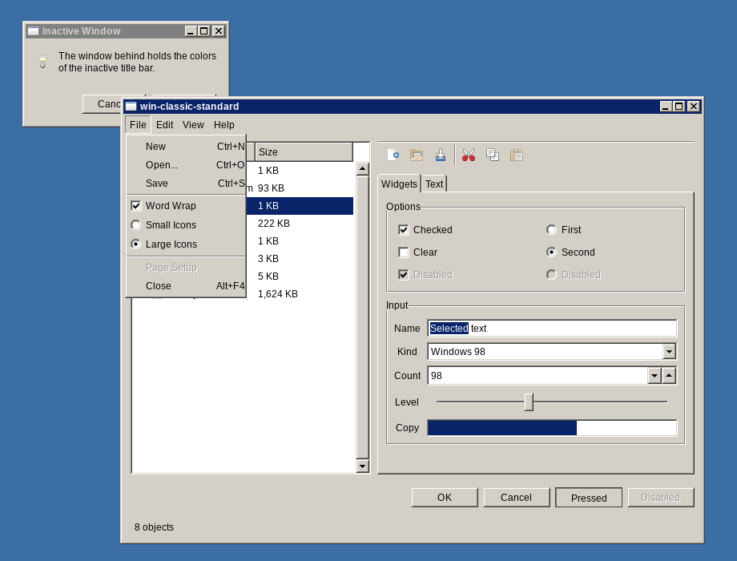
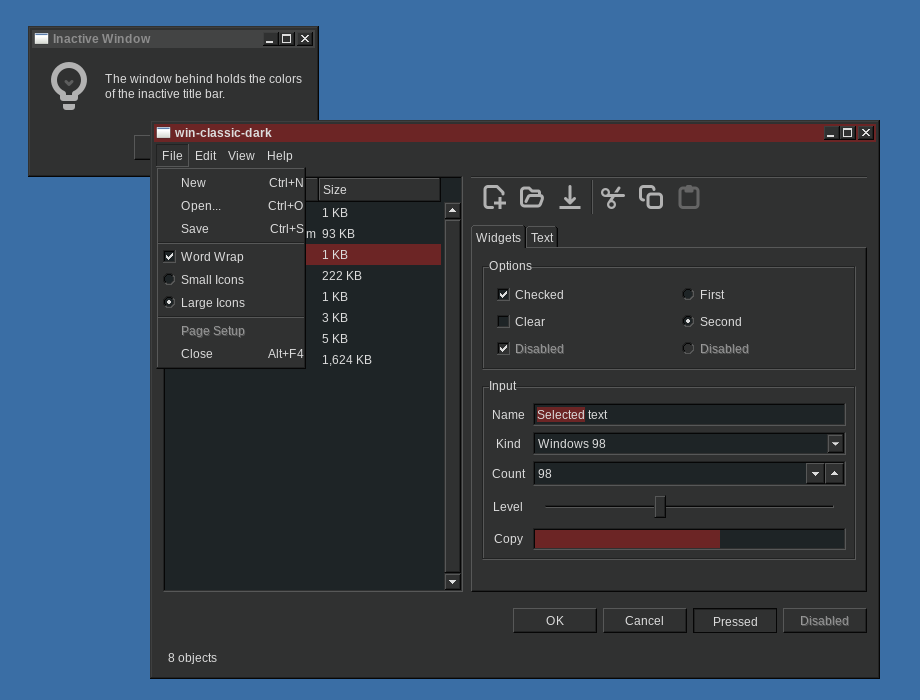

# Development

This file is for the persons who change the theme or build their own scheme.
[README.md](README.md) gives the presets, the colors and the usual examples.

## The development shell

`flake.nix` gives one package for each preset, the screenshots, and a shell
with the commands to make them.

```bash
nix develop
```

| Command                     | What it does                                     |
| --------------------------- | ------------------------------------------------ |
| `nix build .#<preset>`      | build one scheme, for example `.#luna`           |
| `nix build .#screenshots`   | make the screenshots in the sandbox              |
| `update-screenshots`        | make them and copy them to `screenshots/` and `demos/` |
| `preview-theme <preset>`    | open the showcase window with a scheme, on your own display |
| `win-classic-screenshot`    | the screenshot script, on a theme that is already built |
| `nix fmt`                   | format the Nix files                             |

The name of a package is the name of the preset. `nix build .#default` builds
the "Dusk Red" scheme.

`preview-theme` takes a command after the preset. Thus
`preview-theme luna gtk3-widget-factory` opens the widget factory in place of
the showcase window.

Nix reads the files that Git tracks. A new file that is not in the index gives
the error "is not tracked by Git" on the next `nix build`.

## How the build makes the images

The directory `images/` holds one directory for each widget. Each widget
directory holds a stack of gray layers, for example `c_box_background.png`,
`c_box_highlight.png` and `c_box_border.png`. Every layer uses the color
`#ff00fa` as a placeholder.

The build gives one color of the scheme to each layer. It then puts the layers
one on the other. This table shows the color of each layer:

| Layer            | Color                                              |
| ---------------- | -------------------------------------------------- |
| `*background`    | `bgcolor`                                          |
| `*highlight`     | `highlight`, the light edge                        |
| `*shadow`        | `shadow`, the dark edge                            |
| `*border`        | `border`                                           |
| `*base`          | `basecolor`, or `bgcolor` for an insensitive widget |
| `*check`         | `basefg`                                           |
| `*_aa`           | `bgcolor`                                          |
| `*_text`         | `fgcolor`                                          |
| `*_text_disabled`| `disabledfg`, the disabled text                    |

The build then makes the arrows, the scroll bar buttons, the tabs and the
switches from these images. The images do not go in Git. The directory
`images/` is the only source.

## How the build makes the style sheets

The style sheets, the resource files and the window button glyphs hold `@name@`
tokens. The build replaces each token with a color. These files hold tokens:

| File                                            | Tokens                          |
| ----------------------------------------------- | ------------------------------- |
| `gtk-3.0/gtk.css`                                | all colors                      |
| `gtk-2.0/gtkrc`                                  | the GTK2 color scheme           |
| `gtk-3.0/settings.ini`, `gtk-4.0/settings.ini`   | `decorationlayout`              |
| `xfwm4/themerc`                                  | title bar colors, `xfwmbuttons` |
| `xfwm4/*.xpm`                                    | `buttonscolor`                  |
| `index.theme`                                    | `themename`                     |

Do not change a color in a style sheet by hand. The build ignores your change
on the next build of a different scheme. Add a token in its place.

## How the build makes the screenshots

`dev/screenshot.sh` starts an X server with Xvfb, an Xfwm4 with the theme, and
one application. It then takes the screenshot with ImageMagick. It uses a home
directory that holds nothing but the theme. Thus the settings of the user do
not come into the screenshot. `dev/screenshots.nix` gives the script its
programs, its fonts and its D-Bus session. It runs the script one time for each
scheme in the sandbox.

The application in the first screenshot is `dev/showcase.c`. It is a GTK3
window with one widget of each kind. It opens the first menu. It then writes
the file in `READY_FILE` to show that the screenshot is ready. The menu opens
above the list on the left. Thus it hides no important widget.





`demos/` holds the window of one demo of each toolkit, from
`gtk3-demo --run=builder` and `gtk4-demo --run=builder`. The script takes those
two with the `windows-standard` scheme, which AGENTS.md asks for. `demo` in
`dev/screenshot.sh` holds the name of the demo.

To add a scheme to `screenshots/`, add its preset to `shown` in `flake.nix`.
Then run `update-screenshots`.

For each scheme, two screenshots show `gtk3-widget-factory` and
`gtk4-widget-factory`. GTK4 reads the style sheet from
`gtk-4.0/gtk.css` in the configuration directory, and the script writes that
file. GTK4 also looks for a Vulkan device and for the GStreamer elements of
its video widget. The X server of the script has neither, so the script asks
for the cairo renderer and for no media backend.

For each scheme, two more screenshots show `dev/qt-showcase.cpp`, built with
Qt5 and Qt6. The Qt5 program uses `qtstyleplugins`, and the Qt6 program uses
`qt6gtk2`. Both plugins read the GTK2 style sheet of the built theme.

The last two screenshots of a scheme show `opensnitch-ui`, a program of PyQt6.
They are a reference for the widgets that no showcase here holds: a tool box, a
tab bar with icons and a table of events. `<name>-opensnitch.png` holds the
main window and `<name>-opensnitch-prefs.png` holds the Preferences dialog. No
daemon runs in the sandbox, thus the window shows no event and no node.

The program keeps its window in the system tray, and it shows that window when
a second program of the same name asks for it through its local socket. The
script starts a second one for that reason. It then opens the Preferences
dialog with a click on the second button of the tool bar. `prefs_button_x` and
`prefs_button_y` in `dev/screenshot.sh` give the place of that button. The
script waits for the dialog, so the build stops if the button moves.

The screenshot command disables the timed progress indicators in the two
widget factories. Thus repeated builds produce the same pixels. `nix build
--rebuild .#screenshots` compares a second build with the first one.

The files of this section are not part of the theme. `default.nix` keeps them
out of the source. Thus a new screenshot does not build the theme again.

## More options

[README.md](README.md) gives the options `preset` and `colors`. These are the
three other options.

### name

The name of the theme. It sets the directory below `share/themes`, the value of
`gtk-theme-name` and the value of `GTK_THEME`. The default is
`win-classic-theme`.

The flake gives a different name to each preset package. The name is
`win-classic-<preset>`. The two exceptions are `win-classic-98` for
`windows-classic` and `win-classic-standard` for `windows-standard`.

### Calculated colors

The build calculates three more colors from `bgcolor`. It multiplies each
channel, then it adds a gain. Change the multipliers and the gains in the same
`colors` set:

| Name                   | Default         | Function             |
| ---------------------- | --------------- | -------------------- |
| `highlightMultiplier`  | `1.3`           | light edge           |
| `shadowMultiplier`     | `0.7`           | dark edge            |
| `disabledFgMultiplier` | `0.8`           | disabled text        |
| `highlightGain`        | `[ 0.1 0.1 0.1 ]` | red, green and blue to add to the light edge |
| `shadowGain`           | `[ 0.0 0.0 0.0 ]` | red, green and blue to add to the dark edge  |

A gain of `0.1` adds 10 percent of full intensity. A negative gain removes
intensity. The build limits each channel to the range 0 to 255.

With the default `bgcolor`, the build calculates `#575858` for the light edge,
`#212222` for the dark edge and `#262727` for the disabled text.

A Windows scheme holds these three colors. Thus you can give them in `colors`
and stop the calculation. Each preset does this:

| Name         | Windows color     | Function      |
| ------------ | ----------------- | ------------- |
| `highlight`  | ControlLightLight | light edge    |
| `shadow`     | ControlDark       | dark edge     |
| `disabledfg` | GrayText          | disabled text |

### titlebarButtons

An attribute set with two boolean values. Both are `true` by default.

| Name       | Function                    |
| ---------- | --------------------------- |
| `minimize` | show the minimize button    |
| `maximize` | show the maximize button    |

The option sets `gtk-decoration-layout` for GTK and `button_layout` for Xfwm4.
The attribute `passthru.decorationLayout` holds the GTK value. Use it if you
must set the same order at another place.

## More examples

### Example 1: the default scheme

```bash
nix build .#default
```

The default package is the "Dusk Red" scheme. Its name is `win-classic-dark`.
It has all the title bar buttons.

### Example 2: a scheme of Windows

Build the package of a preset. This is the gray scheme of Windows 95 and of
Windows 98:

```bash
nix build .#windows-classic
```

The name of this theme is `win-classic-98`. The face color is `#c0c0c0`. The
title bar is navy `#000080`. The light edge is white and the dark edge is gray
`#808080`.

### Example 3: the colors of Luna

```bash
nix build .#luna
```

The face color is `#ece9d8` and the title bar is blue `#0054e3`. Build
`.#luna-silver` for the gray Luna. Build `.#luna-olive` for the green Luna.

### Example 4: one color of a preset

The values in `colors` have priority over the values of the preset. This
example takes Luna and makes the title bar red:

```nix
inputs.win-classic-theme.packages.${system}.luna.override {
  name = "win-luna-red";
  colors = {
    activetitle = "#6c2525";
    activetitle1 = "#6c2525";
  };
}
```

The result keeps the face color `#ece9d8` of Luna.

### Example 5: a tiling window manager

A tiling window manager does not use the minimize button or the maximize
button. Remove them:

```nix
pkgs.win-classic-theme.override {
  titlebarButtons = {
    minimize = false;
    maximize = false;
  };
}
```

The theme then holds `gtk-decoration-layout=icon:close` and `button_layout=O|C`.
To keep only the minimize button, set `maximize = false` alone. The result is
`icon:minimize,close` and `O|HC`.

### Example 6: a different accent color

Change one color and keep the other defaults:

```nix
pkgs.win-classic-theme.override {
  name = "win-classic-teal";
  colors = {
    selectedbg = "#1c6664";
    activetitle = "#1c6664";
    activetitle1 = "#1c6664";
  };
}
```

### Example 7: flat edges

Set both multipliers to `1.0` and both gains to zero. The light edge and the
dark edge then get the color of `bgcolor`. The widgets become flat:

```nix
pkgs.win-classic-theme.override {
  colors = {
    highlightMultiplier = 1.0;
    shadowMultiplier = 1.0;
    highlightGain = [ 0.0 0.0 0.0 ];
    shadowGain = [ 0.0 0.0 0.0 ];
  };
}
```

### Example 8: a stronger 3D edge

Increase the difference between the two edges:

```nix
pkgs.win-classic-theme.override {
  colors = {
    highlightMultiplier = 1.8;
    shadowMultiplier = 0.4;
  };
}
```

## What the package contains

```
share/themes/<name>/
├── gtk-2.0/    resource files and images
├── gtk-3.0/    style sheets, settings.ini and images
├── gtk-4.0/    style sheets and settings.ini
├── xfwm4/      window decorations
├── wine/       a registry file with the same colors
├── index.theme
└── LICENSE
```

## Notes

- GTK3 reads `settings.ini` from the theme directory. GTK4 does not. A user
  file in `~/.config/gtk-3.0/settings.ini` has priority over the theme.
- The GTK4 style sheet comes to the applications through
  `~/.config/gtk-4.0/gtk.css`, because GTK4 does not apply a theme by name.
  Home Manager writes that file.
- The image `menu_side.png` is for the Xfce4 whisker menu. This build makes it
  without a text label, because the label needs the font Lucida Sans.
