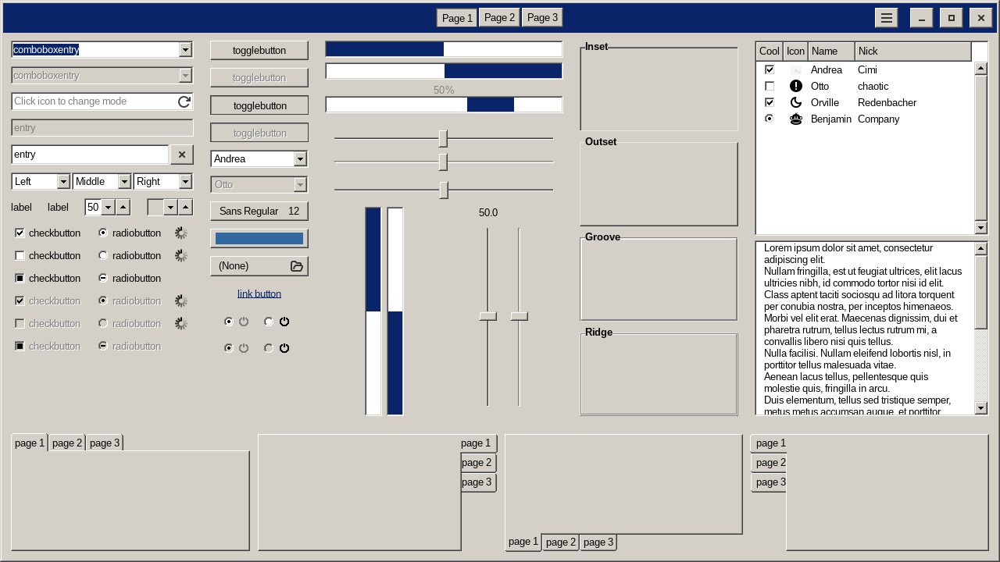
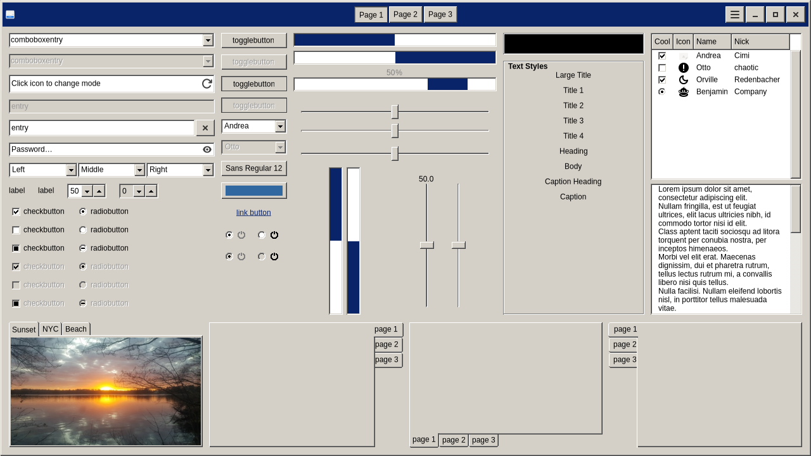
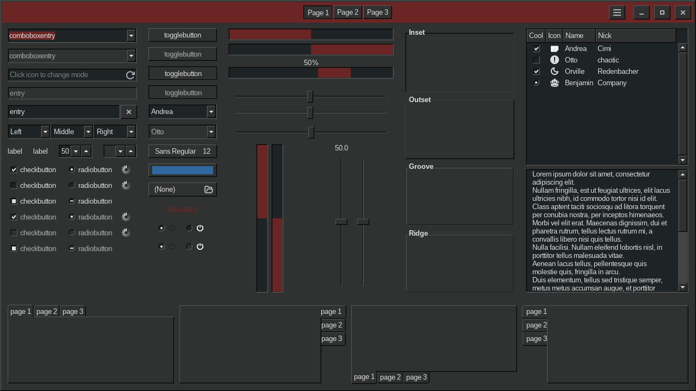
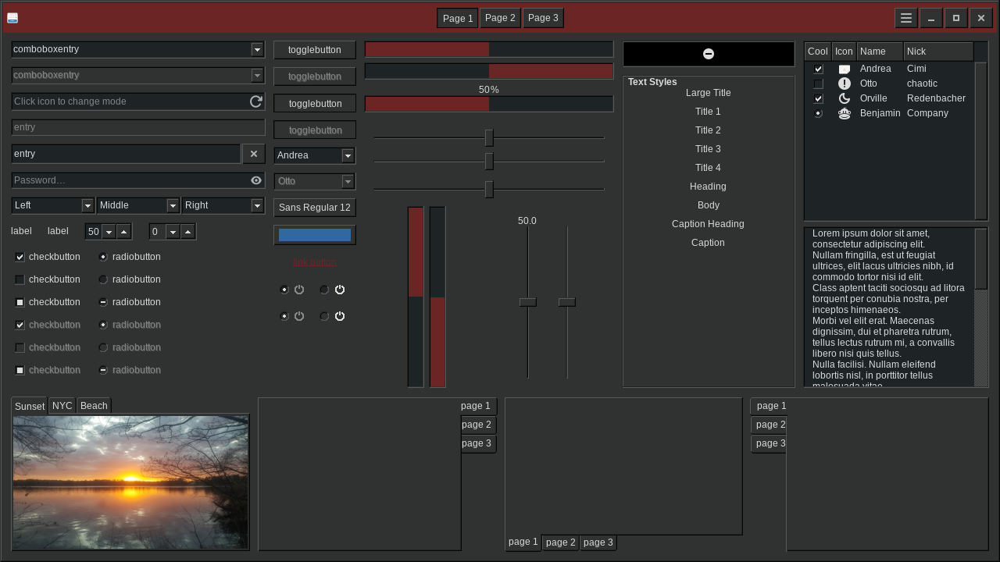

# win-classic-theme

A Windows 9x theme for GTK2, GTK3, GTK4 and Xfwm4. It is a Nix build of
[Redmond97 SE](https://codeberg.org/Sliver_X/Redmond97-SE) by Sliver X.

The Nix build makes the theme from parameters. Give the colors, the name and
the title bar buttons. The build then paints all the images and writes all the
style sheets.

`flake.nix` gives one package for each preset. Build a preset with its name:

```bash
nix build .#luna
```

Change the colors, the name or the title bar buttons with `.override`. See
[Examples](#examples).

[DEVELOPMENT.md](DEVELOPMENT.md) is for the curious reader. It tells how the
build makes the images, the style sheets and the screenshots. It also gives the
other options and more examples.

## Screenshots

`screenshots/` holds three screenshots for each of two schemes. The build makes
these files. Do not make them by hand.

### `windows-standard`, the scheme of Windows 2000 and of Windows XP






### `dark`, the "Dusk Red" scheme






The first screenshot of a scheme holds two windows and one open menu. Xfwm4
makes the title bars. The second screenshot is the window of
`gtk3-widget-factory` and the third one is the window of
`gtk4-widget-factory`. Each of those windows holds one widget of every kind.
The two windows show what the theme does in GTK3 and in GTK4.

## Options

The options are the arguments of `default.nix`. Set them with `.override` on a
package of the flake:

```nix
inputs.win-classic-theme.packages.${system}.luna.override {
  name = "win-luna-red";
  colors.activetitle = "#6c2525";
}
```

The overlay `overlays.default` puts `win-classic-theme` in `pkgs`. That package
uses the default scheme. Give it the same arguments with `.override`.

This file gives the options `preset` and `colors`. The options `name`,
`titlebarButtons` and the multipliers of the calculated colors are in
[DEVELOPMENT.md](DEVELOPMENT.md).

### preset

The name of a color scheme in `presets.nix`. The default is `null`, which gives
the default scheme. The values of `colors` have priority over the values of the
preset. Thus you can change one color of a preset.

`presets.nix` holds the system colors of Windows XP. The source of the values is
[this gist](https://gist.github.com/zaxbux/64b5a88e2e390fb8f8d24eb1736f71e0).
The file also holds the table that maps each Windows color name to a color of
the theme.

| Preset             | Windows scheme                              |
| ------------------ | ------------------------------------------- |
| `windows-classic`  | the gray scheme of Windows 95 and 98        |
| `windows-standard` | the scheme of Windows 2000 and XP           |
| `dark`             | "Dusk Red", the dark scheme of this theme   |
| `luna`             | Luna, the blue scheme of Windows XP         |
| `luna-silver`      | Luna (Silver)                               |
| `luna-olive`       | Luna (Olive Green)                          |
| `brick`            | classic scheme "Brick"                      |
| `desert`           | classic scheme "Desert"                     |
| `eggplant`         | classic scheme "Eggplant"                   |
| `lilac`            | classic scheme "Lilac"                      |
| `maple`            | classic scheme "Maple"                      |
| `marine`           | classic scheme "Marine"                     |
| `plum`             | classic scheme "Plum"                       |
| `pumpkin`          | classic scheme "Pumpkin"                    |
| `rainy-day`        | classic scheme "Rainy Day"                  |
| `red-white-blue`   | classic scheme "Red White Blue"             |
| `rose`             | classic scheme "Rose"                       |
| `slate`            | classic scheme "Slate"                      |
| `spruce`           | classic scheme "Spruce"                     |
| `storm`            | classic scheme "Storm"                      |
| `teal`             | classic scheme "Teal"                       |
| `wheat`            | classic scheme "Wheat"                      |

A preset of Windows gives the 3D edges and the disabled text, because Windows
gives these three colors. The build then does not calculate them. The preset
`dark` is not a scheme of Windows. It holds the colors that this theme builds
without a preset. It gives none of the three colors, thus the build calculates
them.

The built theme holds the set in `passthru.presets`. A name that is not in the
set gives an error with the list of the names.

The presets give the colors of Windows. They do not change the shape of a
widget. A Luna preset gives you the colors of Luna on the widgets of Windows
9x, not the round buttons of Luna.

### colors

An attribute set. The names are the names of Windows 9x color schemes. The
default is the Redmond97 SE "Dusk Red" scheme. A value here has priority over
the same value in a preset.

| Name                | Default     | Function                        |
| ------------------- | ----------- | ------------------------------- |
| `bgcolor`           | `#303131`   | 3D objects, window background   |
| `fgcolor`           | `#dddddd`   | text on 3D objects              |
| `border`            | `#060606`   | borders                         |
| `selectedbg`        | `#6c2525`   | selection background            |
| `selectedtext`      | `#dddddd`   | selection text                  |
| `activetitle`       | `#6c2525`   | active title bar                |
| `activetitle1`      | `#6c2525`   | second color of the title bar   |
| `activetitletext`   | `#dddddd`   | active title bar text           |
| `inactivetitle`     | `#434444`   | inactive title bar              |
| `inactivetitletext` | `#8d8d8d`   | inactive title bar text         |
| `basecolor`         | `#1e2426`   | text boxes and lists            |
| `basefg`            | `#dddddd`   | text in text boxes and lists    |
| `tooltipbg`         | `#ffe0a8`   | tool tip background             |
| `tooltipfg`         | `#000000`   | tool tip text                   |
| `buttonscolor`      | `#dddddd`   | window button glyphs            |

Give each color as a six digit hex value with a `#` in front.

A tool tip has one flat line on the four sides, in the color of `border`. It
does not have the 3D edge of a window. A tool tip is a light box in each
scheme, as in Windows. Thus the presets do not change `tooltipbg` and
`tooltipfg`.

The build calculates the two 3D edges and the disabled text from `bgcolor`. The
same `colors` set holds the multipliers of that calculation. See
[DEVELOPMENT.md](DEVELOPMENT.md).

## Examples

### Example 1: a light theme

These are the colors of the Redmond97 SE "Millennium" scheme. The overlay gives
`pkgs.win-classic-theme`, which has no preset:

```nix
pkgs.win-classic-theme.override {
  name = "win-classic-light";
  colors = {
    bgcolor = "#d4d0c8";
    fgcolor = "#000000";
    border = "#060606";
    selectedbg = "#002468";
    selectedtext = "#ffffff";
    activetitle = "#7191c2";
    activetitle1 = "#7191c2";
    activetitletext = "#f8fcf8";
    inactivetitle = "#808080";
    inactivetitletext = "#ffffff";
    basecolor = "#ffffff";
    basefg = "#000000";
    buttonscolor = "#000000";
  };
}
```

The build calculates `#ffffff` for the light edge, `#94918c` for the dark edge
and `#a9a6a0` for the disabled text.

### Example 2: the theme in another flake

Add the flake as an input. Then add the overlay to `pkgs`:

```nix
{
  inputs = {
    nixpkgs.url = "github:NixOS/nixpkgs/nixos-unstable";
    win-classic-theme.url = "github:menduz/win-classic-theme";
  };

  outputs =
    { nixpkgs, win-classic-theme, ... }:
    let
      system = "x86_64-linux";
      pkgs = import nixpkgs {
        inherit system;
        overlays = [ win-classic-theme.overlays.default ];
      };
    in
    {
      # pkgs.win-classic-theme                        the default scheme
      # pkgs.win-classic-theme.override { ... }        your own colors
      # win-classic-theme.packages.${system}.luna      a preset
    };
}
```

### Example 3: the theme in Home Manager

Give the package and the same name to `gtk.theme`:

```nix
gtk = {
  enable = true;
  theme = {
    name = "win-classic-dark";
    package = inputs.win-classic-theme.packages.${system}.dark;
  };
};
```

Xfwm4 reads the theme by name. Set the same name in the Xfwm4 settings of
Xfce, in the property `/general/theme` of the channel `xfwm4`.

## License

GPL 3. See `LICENSE`. The images and the style sheets come from Redmond97 SE by
Sliver X.
