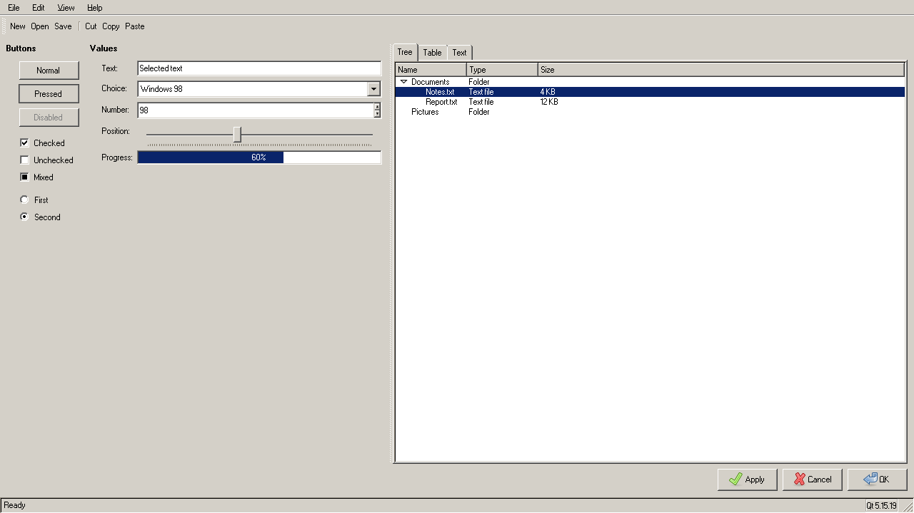
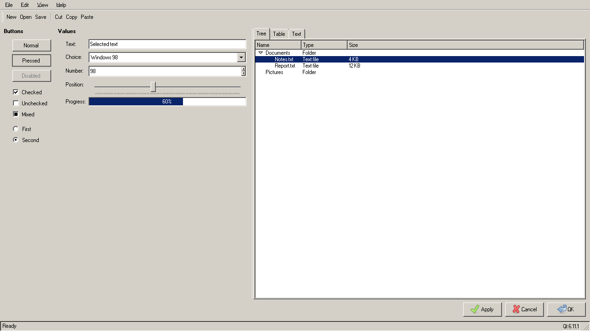
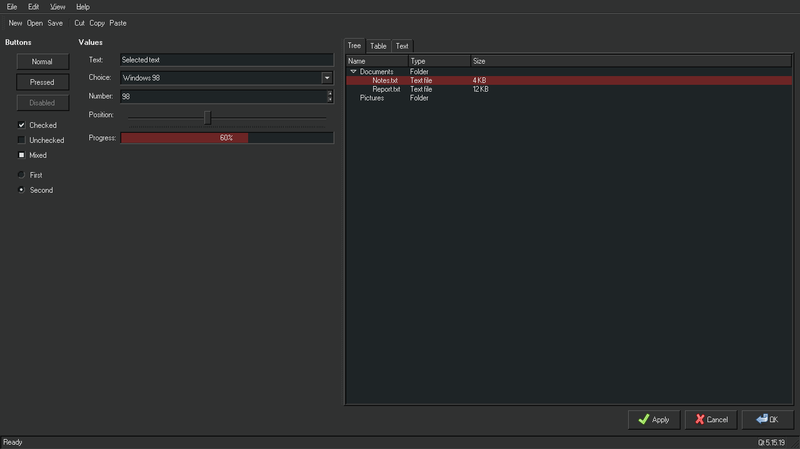
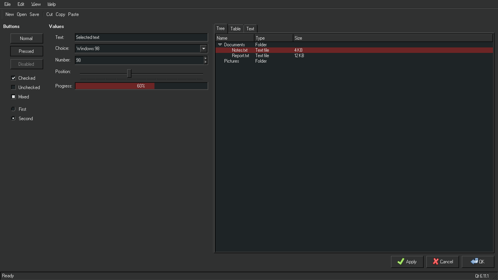

# win-classic-theme

A Windows 9x theme for GTK2, GTK3, GTK4 and Xfwm4. It is a Nix build of
[Redmond97 SE](https://codeberg.org/Sliver_X/Redmond97-SE) by Sliver X.

[DEVELOPMENT.md](DEVELOPMENT.md) tells how the build works.

## Screenshots

### `windows-standard`






### `dark`






## Presets

Build one preset with its name:

```bash
nix build .#luna
```

| Preset             | Windows scheme                              |
| ------------------ | ------------------------------------------- |
| `windows-classic`  | the gray scheme of Windows 95 and 98        |
| `windows-standard` | the scheme of Windows 2000 and XP           |
| `dark`             | "Dusk Red", the dark scheme of this theme   |
| `luna`             | Luna, the blue scheme of Windows XP         |
| `luna-silver`      | Luna (Silver)                               |
| `luna-olive`       | Luna (Olive Green)                          |
| `brick`            | classic scheme "Brick"                      |
| `desert`           | classic scheme "Desert"                     |
| `eggplant`         | classic scheme "Eggplant"                   |
| `lilac`            | classic scheme "Lilac"                      |
| `maple`            | classic scheme "Maple"                      |
| `marine`           | classic scheme "Marine"                     |
| `plum`             | classic scheme "Plum"                       |
| `pumpkin`          | classic scheme "Pumpkin"                    |
| `rainy-day`        | classic scheme "Rainy Day"                  |
| `red-white-blue`   | classic scheme "Red White Blue"             |
| `rose`             | classic scheme "Rose"                       |
| `slate`            | classic scheme "Slate"                      |
| `spruce`           | classic scheme "Spruce"                     |
| `storm`            | classic scheme "Storm"                      |
| `teal`             | classic scheme "Teal"                       |
| `wheat`            | classic scheme "Wheat"                      |

`nix build .#default` builds the "Dusk Red" scheme. The name of the theme below
`share/themes` is `win-classic-<preset>`, with `win-classic-98` for
`windows-classic` and `win-classic-standard` for `windows-standard`.

## Colors

`.override` changes the colors of a package. A value here has priority over the
value of the preset:

```nix
win-classic-theme.packages.${system}.luna.override {
  name = "win-luna-red";
  colors = {
    activetitle = "#6c2525";
    activetitle1 = "#6c2525";
  };
}
```

| Name                | Default     | Function                        |
| ------------------- | ----------- | ------------------------------- |
| `bgcolor`           | `#303131`   | 3D objects, window background   |
| `fgcolor`           | `#dddddd`   | text on 3D objects              |
| `border`            | `#060606`   | borders                         |
| `selectedbg`        | `#6c2525`   | selection background            |
| `selectedtext`      | `#dddddd`   | selection text                  |
| `activetitle`       | `#6c2525`   | active title bar                |
| `activetitle1`      | `#6c2525`   | second color of the title bar   |
| `activetitletext`   | `#dddddd`   | active title bar text           |
| `inactivetitle`     | `#434444`   | inactive title bar              |
| `inactivetitletext` | `#8d8d8d`   | inactive title bar text         |
| `basecolor`         | `#1e2426`   | text boxes and lists            |
| `basefg`            | `#dddddd`   | text in text boxes and lists    |
| `tooltipbg`         | `#ffe0a8`   | tool tip background             |
| `tooltipfg`         | `#000000`   | tool tip text                   |
| `buttonscolor`      | `#dddddd`   | window button glyphs            |

Give each color as a six digit hex value with a `#` in front. The build
calculates the two 3D edges and the disabled text from `bgcolor`. See
[DEVELOPMENT.md](DEVELOPMENT.md) for those three colors, for `name` and for
`titlebarButtons`.

## Modules

A desktop session has a system part and a user part, so the flake gives two
modules. Both read the same options below `programs.win-classic-theme`, so a
configuration declares the same block in each one.

| Module                       | What it writes                                                                           |
| ---------------------------- | ---------------------------------------------------------------------------------------- |
| `nixosModules.default`       | `/etc/xdg/gtk-{3,4}.0/settings.ini`, the schemes, the fonts, `GTK_THEME`                  |
| `homeManagerModules.default` | the GTK files of the user, the style sheet, the cursor, the Qt style, the GSettings keys |

The NixOS module alone gives a themed session. The Home Manager module adds
the files that only a user has, such as `~/.gtkrc-2.0` for the GTK2 style of
Qt.

`schemes` gives the color schemes to build. Every scheme goes into the profile,
and `variant` names the one that the session starts with.

```nix
{
  inputs = {
    nixpkgs.url = "github:NixOS/nixpkgs/nixos-unstable";
    home-manager.url = "github:nix-community/home-manager";
    win-classic-theme.url = "github:menduz/win-classic-theme";
  };

  outputs =
    { nixpkgs, home-manager, win-classic-theme, ... }:
    let
      # The same block for both modules.
      theme = {
        enabled = true;
        variant = "standard";
        schemes = {
          dark = { preset = "dark"; dark = true; };
          standard = { preset = "windows-standard"; };
        };
        font = { name = "MS Sans Serif"; size = 8; };
      };
    in
    {
      nixosConfigurations.desktop = nixpkgs.lib.nixosSystem {
        system = "x86_64-linux";
        modules = [
          win-classic-theme.nixosModules.default
          home-manager.nixosModules.home-manager
          {
            programs.win-classic-theme = theme;

            home-manager.users.alice = {
              imports = [ win-classic-theme.homeManagerModules.default ];
              # The NixOS module already installs the schemes.
              programs.win-classic-theme = theme // { installPackages = false; };
            };
          }
        ];
      };
    };
}
```

The overlay also puts `win-classic-theme` in `pkgs` for a configuration that
wants the package alone:

```nix
{ nixpkgs.overlays = [ win-classic-theme.overlays.default ]; }
```

### A light scheme and a dark scheme

`schemes` takes as many schemes as a configuration wants, and it builds every
one of them. `variant` names the scheme that the session starts with:

```nix
programs.win-classic-theme = {
  enabled = true;
  variant = "dark";

  schemes = {
    dark = {
      preset = "dark"; # Redmond97 SE "Dusk Red"
      dark = true; # gives `prefer-dark` and `gtk-application-prefer-dark-theme`
    };
    light = {
      preset = "windows-standard"; # Windows XP "Windows Standard"
    };
  };
};
```

A scheme takes four keys:

| Key      | Meaning                                                                    |
| -------- | -------------------------------------------------------------------------- |
| `preset` | the name of a scheme in `presets.nix`                                       |
| `colors` | single colors, which win over the same color of `preset`                    |
| `dark`   | whether the scheme is a dark one                                            |
| `name`   | the name below `share/themes`, `win-classic-` and the name of the scheme    |

The two schemes above build `win-classic-dark` and `win-classic-light`. A
scheme can also start from a preset and change single colors:

```nix
midnight = {
  preset = "dark";
  dark = true;
  colors = {
    activetitle = "#1a3a6c";
    activetitle1 = "#2a5a9c";
  };
};
```

### The scheme of a running session

`variant` gives the scheme of a new session. A running session takes another
scheme from three values, and none of them needs a rebuild:

| Value                                          | Who reads it                        |
| ---------------------------------------------- | ----------------------------------- |
| `org.gnome.desktop.interface gtk-theme`         | GTK, through the settings portal    |
| `org.gnome.desktop.interface color-scheme`      | a program that follows dark or light |
| `GTK_THEME`                                     | a program that libadwaita draws     |

A script that changes to `win-classic-light` sets the three:

```sh
gsettings set org.gnome.desktop.interface gtk-theme win-classic-light
gsettings set org.gnome.desktop.interface color-scheme prefer-light

# A program that systemd or a portal starts reads this environment. Export the
# value first, because dbus-update-activation-environment copies it from this
# shell.
export GTK_THEME=win-classic-light
systemctl --user set-environment "GTK_THEME=$GTK_THEME"
dbus-update-activation-environment --systemd GTK_THEME
```

Every scheme of `schemes` must be in the profile for this to work. GTK looks a
theme up in `$XDG_DATA_DIRS/themes`, so it cannot select a scheme that no
profile holds. `installPackages` puts them there.

A GTK program that is already open keeps its colors, because the GTK files are
in the store. A new window takes the new scheme; an open one needs a restart.

### Options

| Option                      | Default            | Meaning                                            |
| --------------------------- | ------------------ | -------------------------------------------------- |
| `enabled`                   | `false`            | whether the module writes anything                  |
| `patchQt`                   | `false`            | whether to use the patched Qt GTK2 bridges          |
| `schemes`                   | `dark`, `standard` | the schemes to build                                |
| `variant`                   | `"dark"`           | the scheme that the session starts with             |
| `titlebarButtons`           | all                | the buttons of a title bar                          |
| `decorationLayout`          | that of the theme  | `gtk-decoration-layout`, the buttons that GTK draws |
| `windowManagerButtonLayout` | that of the theme  | the buttons that the window manager draws           |
| `font`                      | MS Sans Serif 8    | the interface font                                  |
| `iconTheme`                 | Chicago95          | the icon theme                                      |
| `cursorTheme`               | Adwaita 16         | the cursor theme                                    |
| `fontRendering`             | 96 dpi, hintslight | antialias, hinting, subpixel order and dpi          |
| `gtk3Settings`              | `{ }`              | keys to add to the GTK3 settings, or to replace     |
| `gtk4Settings`              | `{ }`              | keys to add to the GTK4 settings, or to replace     |
| `extraCss`                  | `""`               | style sheet rules below the theme                   |
| `installPackages`           | `true`             | whether the schemes go into the profile             |

Xfwm4 reads the theme by name. Set the same name in the property
`/general/theme` of the channel `xfwm4`.

### A program that draws its own scroll bar

GTK4 draws a scroll bar on top of the content. The theme paints the trough with
a dither image, which then hides the text below the bar.
`config.programs.win-classic-theme.scrollbarCss` is a style sheet that shows
the slider alone. Give the file to such a program, for example with the
`gtk-custom-css` key of Ghostty.

## License

GPL 3. See `LICENSE`. The images and the style sheets come from Redmond97 SE by
Sliver X.

`fonts/` holds the interface font, the FontStruction "MS Sans Serif" and
"MS Sans Serif Bold" by "lou", under a
[Creative Commons Attribution Share Alike 3.0](http://creativecommons.org/licenses/by-sa/3.0/)
license. Each directory keeps the license and the readme of the author beside
the font file, as that license asks.
