# win-classic-theme

A Windows 9x theme for GTK2, GTK3, GTK4, Xfwm4, KWin and Plasma. It is a Nix build of
[Redmond97 SE](https://codeberg.org/Sliver_X/Redmond97-SE) by Sliver X.

[DEVELOPMENT.md](DEVELOPMENT.md) tells how the build works.

## Screenshots

### `windows-standard`

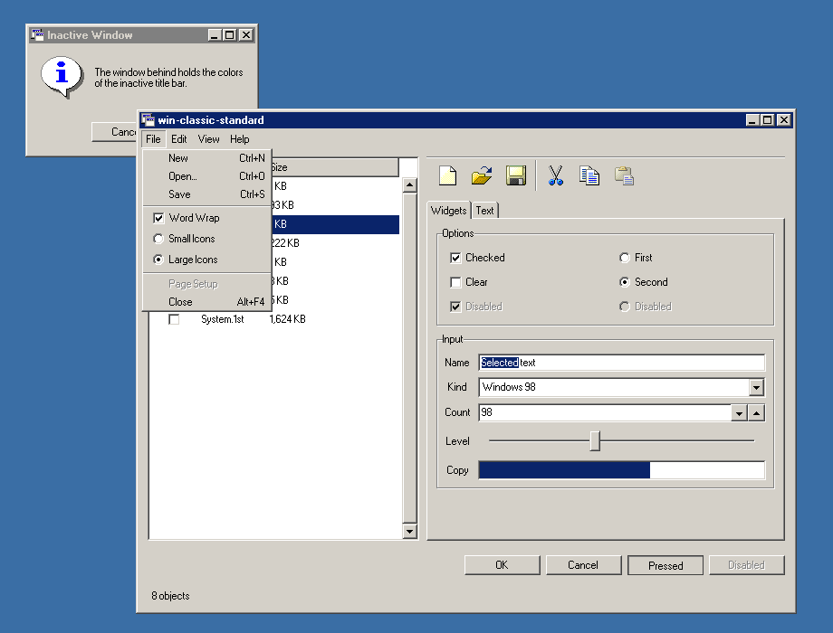

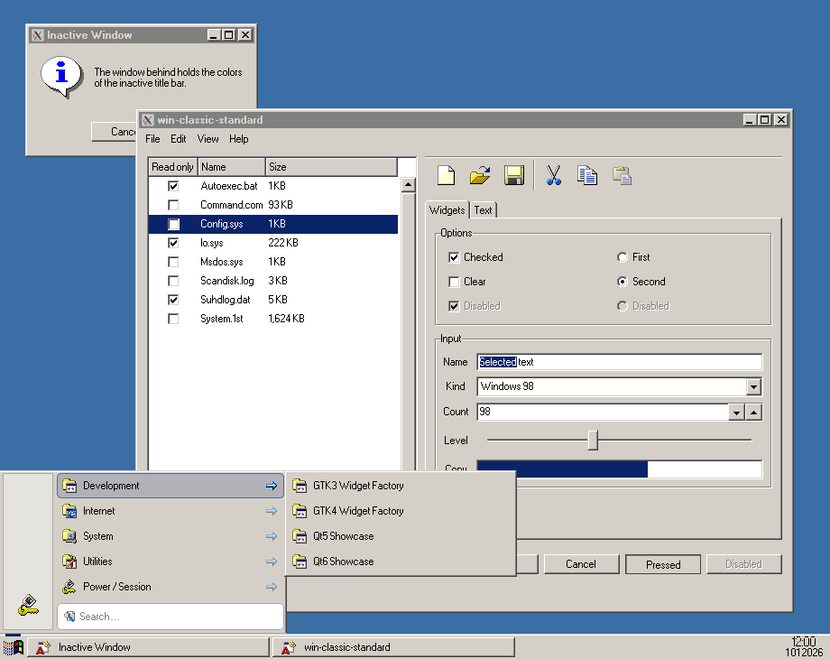

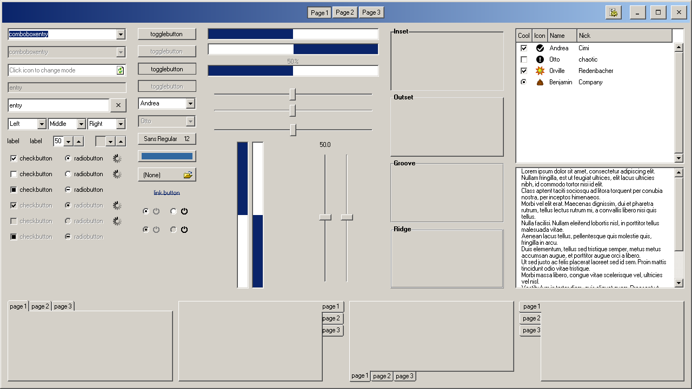

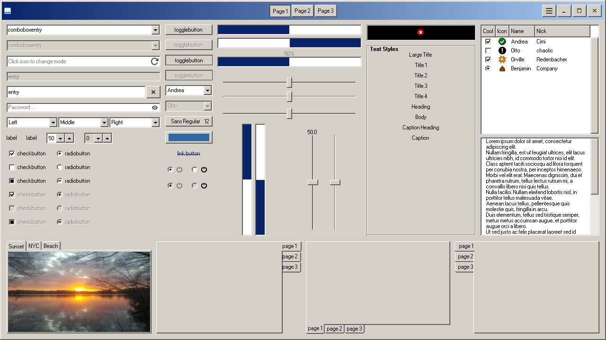

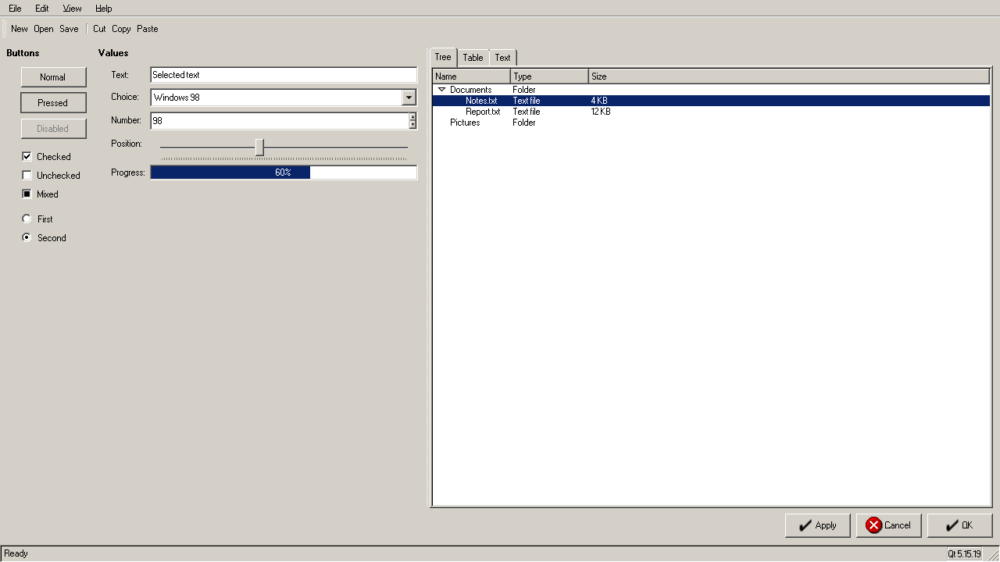


### `dark`

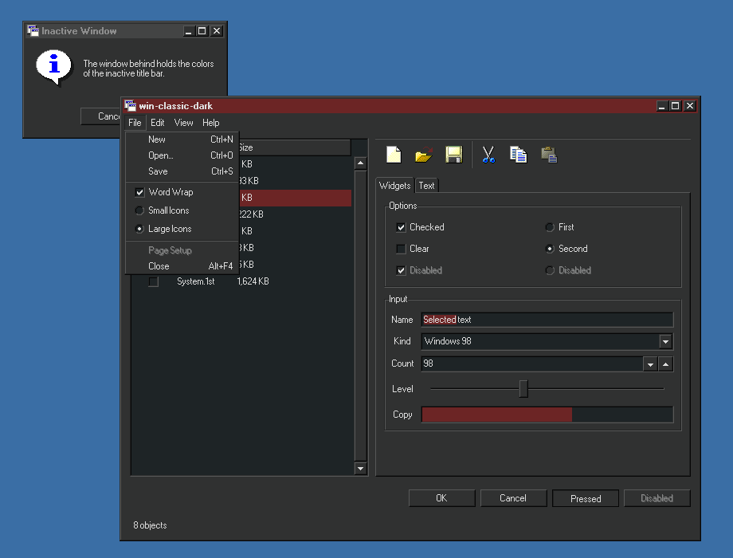

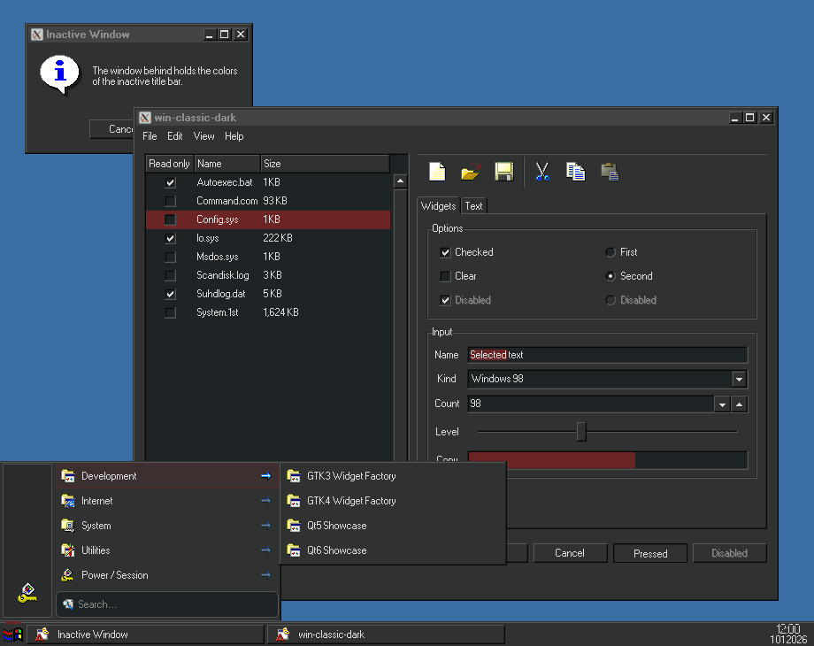

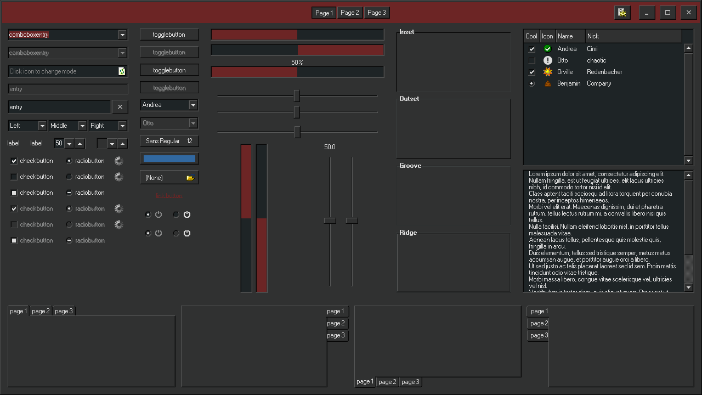

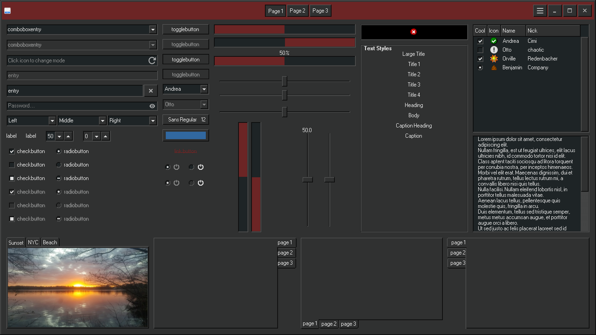

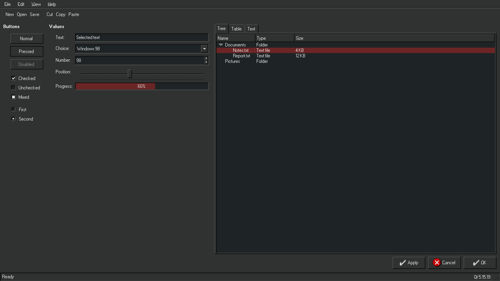

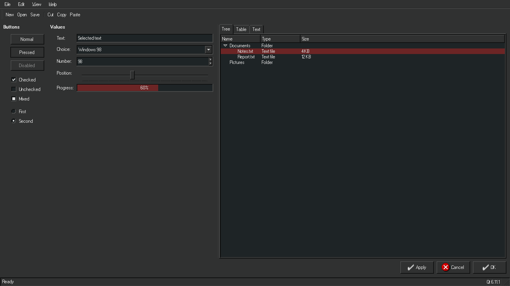

## Presets

Build one preset with its name:

```bash
nix build .#luna
```

| Preset             | Windows scheme                              |
| ------------------ | ------------------------------------------- |
| `windows-classic`  | the gray scheme of Windows 95 and 98        |
| `windows-standard` | the scheme of Windows 2000 and XP           |
| `dark`             | "Dusk Red", the dark scheme of this theme   |
| `luna`             | Luna, the blue scheme of Windows XP         |
| `luna-silver`      | Luna (Silver)                               |
| `luna-olive`       | Luna (Olive Green)                          |
| `brick`            | classic scheme "Brick"                      |
| `desert`           | classic scheme "Desert"                     |
| `eggplant`         | classic scheme "Eggplant"                   |
| `lilac`            | classic scheme "Lilac"                      |
| `maple`            | classic scheme "Maple"                      |
| `marine`           | classic scheme "Marine"                     |
| `plum`             | classic scheme "Plum"                       |
| `pumpkin`          | classic scheme "Pumpkin"                    |
| `rainy-day`        | classic scheme "Rainy Day"                  |
| `red-white-blue`   | classic scheme "Red White Blue"             |
| `rose`             | classic scheme "Rose"                       |
| `slate`            | classic scheme "Slate"                      |
| `spruce`           | classic scheme "Spruce"                     |
| `storm`            | classic scheme "Storm"                      |
| `teal`             | classic scheme "Teal"                       |
| `wheat`            | classic scheme "Wheat"                      |

The name of the theme below `share/themes` is `win-classic-<preset>`, with
`win-classic-98` for `windows-classic` and `win-classic-standard` for
`windows-standard`. `nix build .#default` builds a theme with three schemes:
refer to [The three schemes](#the-three-schemes).

## Colors

`.override` changes the colors of a package. A value here has priority over the
value of the preset:

```nix
win-classic-theme.packages.${system}.luna.override (old: {
  name = "win-luna-red";
  colors = old.colors // {
    activetitle = "#6c2525";
    activetitle1 = "#6c2525";
  };
})
```

The flake output `lib.${system}` gives the functions that build the theme.
`mkScheme` makes one scheme from colors alone, and `mkTheme` puts three
schemes in one theme:

```nix
let
  inherit (win-classic-theme.lib.${system}) mkScheme mkTheme presets;
in
mkTheme {
  name = "win-luna";
  light = mkScheme { name = "win-luna-day"; colors = presets.luna; };
  dark = mkScheme { name = "win-luna-night"; colors = presets.dark; };
}
```

| Name                | Default     | Function                        |
| ------------------- | ----------- | ------------------------------- |
| `bgcolor`           | `#303131`   | 3D objects, window background   |
| `fgcolor`           | `#dddddd`   | text on 3D objects              |
| `border`            | `#060606`   | borders                         |
| `selectedbg`        | `#6c2525`   | selection background            |
| `selectedtext`      | `#dddddd`   | selection text                  |
| `activetitle`       | `#6c2525`   | active title bar                |
| `activetitle1`      | `#6c2525`   | second color of the title bar   |
| `activetitletext`   | `#dddddd`   | active title bar text           |
| `inactivetitle`     | `#434444`   | inactive title bar              |
| `inactivetitletext` | `#8d8d8d`   | inactive title bar text         |
| `basecolor`         | `#1e2426`   | text boxes and lists            |
| `basefg`            | `#dddddd`   | text in text boxes and lists    |
| `tooltipbg`         | `#ffe0a8`   | tool tip background             |
| `tooltipfg`         | `#000000`   | tool tip text                   |
| `buttonscolor`      | `#dddddd`   | window button glyphs            |
| `desktop`           | `#29272b`   | desktop, below the windows      |

Give each color as a six digit hex value with a `#` in front. The build
calculates the two 3D edges and the disabled text from `bgcolor`. See
[DEVELOPMENT.md](DEVELOPMENT.md) for those three colors, for `name` and for
`titlebarButtons`.

## Modules

A desktop session has a system part and a user part, so the flake gives two
modules. Both read the same options below `programs.win-classic-theme`, so a
configuration declares the same block in each one.

| Module                       | What it writes                                                                           |
| ---------------------------- | ---------------------------------------------------------------------------------------- |
| `nixosModules.default`       | `/etc/xdg/gtk-{3,4}.0/settings.ini`, the theme                                            |
| `homeManagerModules.default` | the GTK files of the user, the style sheet, the cursor, the Qt style, the GSettings keys |

The NixOS module alone gives a themed session. The Home Manager module adds
the files that only a user has, such as `~/.gtkrc-2.0` for the GTK2 style of
Qt.

`light`, `dark` and `contrast` give the color schemes, and `variant` names the
one that the session starts with.

```nix
{
  inputs = {
    nixpkgs.url = "github:NixOS/nixpkgs/nixos-unstable";
    home-manager.url = "github:nix-community/home-manager";
    win-classic-theme.url = "github:menduz/win-classic-theme";
  };

  outputs =
    { nixpkgs, home-manager, win-classic-theme, ... }:
    let
      # The same block for both modules.
      theme = {
        enabled = true;
        variant = "light";
        light.preset = "windows-standard";
        dark.preset = "dark";
        baseFontSize = 8;
      };
    in
    {
      nixosConfigurations.desktop = nixpkgs.lib.nixosSystem {
        system = "x86_64-linux";
        modules = [
          win-classic-theme.nixosModules.default
          home-manager.nixosModules.home-manager
          {
            programs.win-classic-theme = theme;

            # The theme installs no font. It draws with the family below.
            fonts.packages = [
              win-classic-theme.packages.x86_64-linux.ms-sans-serif
            ];
            fonts.fontconfig.defaultFonts.sansSerif = [ "MS Sans Serif" ];

            home-manager.users.alice = {
              imports = [ win-classic-theme.homeManagerModules.default ];
              # The NixOS module already installs the theme.
              programs.win-classic-theme = theme // { installPackages = false; };
            };
          }
        ];
      };
    };
}
```

The overlay also puts `win-classic-theme` and `ms-sans-serif` in `pkgs` for a
configuration that wants a package alone:

```nix
{ nixpkgs.overlays = [ win-classic-theme.overlays.default ]; }
```

### The three schemes

A theme holds a light scheme, a dark scheme and a high contrast scheme:

```nix
programs.win-classic-theme = {
  enabled = true;
  name = "win-classic";
  variant = "dark";

  light.preset = "windows-standard"; # Windows XP "Windows Standard"
  dark.preset = "dark"; # Redmond97 SE "Dusk Red"
  contrast = null;
};
```

A scheme takes two keys:

| Key      | Meaning                                                  |
| -------- | -------------------------------------------------------- |
| `preset` | the name of a scheme in `presets.nix`                    |
| `colors` | single colors, which win over the same color of `preset` |

A scheme that is null takes the colors of another one. A configuration that
gives only `dark` gets the dark scheme in all three. When `contrast` is null,
the high contrast scheme follows the color scheme.

The theme has these directories below `share/themes`:

| Name                    | Contents                                                       |
| ----------------------- | -------------------------------------------------------------- |
| `win-classic-light`     | the light scheme                                               |
| `win-classic-dark`      | the dark scheme                                                |
| `win-classic-contrast`  | the high contrast scheme                                       |
| `win-classic`           | the three schemes in one GTK4 style sheet; else the light one  |

GTK2, GTK3, GTK4, Xfwm4 and rofi select a scheme by its name. The GTK4 style
sheet of `win-classic` holds a block for `@media (prefers-color-scheme: dark)`
and one for `@media (prefers-contrast: more)`. Thus a program with that theme
follows the color scheme and the contrast of the desktop, also while it runs.

The theme of each scheme also holds an icon theme below `share/icons/<name>`:
the action icons of SE98kde in the colors of the scheme. The icons of the window
buttons come from SE98. The theme inherits SE98, which looks for missing icons
in Chicago95, then Papirus symbolic icons, then Adwaita.

A scheme can also start from a preset and change single colors:

```nix
dark = {
  preset = "dark";
  colors = {
    activetitle = "#1a3a6c";
    activetitle1 = "#2a5a9c";
  };
};
```

### A program that libadwaita draws

libadwaita reads a theme only from `GTK_THEME`. Give it the theme with the
three schemes, for that program alone:

```sh
GTK_THEME=win-classic ghostty
```

Do not set `GTK_THEME` for the session. GTK3 and GTK4 then read no theme from
GSettings, and stay on one scheme.

### The scheme of a running session

`variant` gives the scheme of a new session. A running session takes another
scheme from these values, and none of them needs a rebuild:

| Value                                              | Who reads it                                |
| -------------------------------------------------- | ------------------------------------------- |
| `org.gnome.desktop.interface gtk-theme`            | GTK3, GTK4, kwm and rofi                    |
| `org.gnome.desktop.interface icon-theme`           | GTK3 and GTK4                               |
| `org.gnome.desktop.interface color-scheme`         | libadwaita, a program that follows dark     |
| `org.gnome.desktop.a11y.interface high-contrast`   | libadwaita, through the settings portal     |

A script that changes to the light scheme sets the four:

```sh
gsettings set org.gnome.desktop.interface gtk-theme win-classic-light
gsettings set org.gnome.desktop.interface icon-theme win-classic-light
gsettings set org.gnome.desktop.interface color-scheme prefer-light
gsettings set org.gnome.desktop.a11y.interface high-contrast false
```

A GTK3 or GTK4 program that runs takes the new scheme at once. GTK finds a
theme in `$XDG_DATA_DIRS/themes`, so the theme must be in a profile.
`installPackages` puts it there.

GTK 4.22 reads the color scheme from the settings portal at the start, but
applies it to `@media (prefers-color-scheme)` only after the first change. A
GTK4 program without libadwaita that starts with the dark scheme thus shows the
light rules of `win-classic`. libadwaita gives the color scheme to GTK itself,
so a libadwaita program has no such fault. A GTK4 program without libadwaita
reads the theme of its scheme by name, and does not use `win-classic`.

### Options

| Option                      | Default            | Meaning                                            |
| --------------------------- | ------------------ | -------------------------------------------------- |
| `enabled`                   | `false`            | whether the module writes anything                  |
| `name`                      | `"win-classic"`    | the name of the theme below `share/themes`          |
| `light`, `dark`, `contrast` | `null`             | the schemes; refer to "The three schemes"           |
| `variant`                   | `"dark"`           | `light`, `dark` or `contrast`: the start scheme     |
| `titlebarButtons`           | all                | the buttons of a title bar                          |
| `decorationLayout`          | that of the theme  | `gtk-decoration-layout`, the buttons that GTK draws |
| `windowManagerButtonLayout` | that of the theme  | the buttons that the window manager draws           |
| `baseFontSize`              | `8`                | the size of the interface font, in points           |
| `iconTheme`                 | that of the scheme | SE98, Chicago95, Papirus symbolic, then Adwaita     |
| `cursorTheme`               | Adwaita 16         | the cursor theme                                    |
| `fontRendering`             | 96 dpi, hintslight | antialias, hinting, subpixel order and dpi          |
| `gtk3Settings`              | `{ }`              | keys to add to the GTK3 settings, or to replace     |
| `gtk4Settings`              | `{ }`              | keys to add to the GTK4 settings, or to replace     |
| `extraCss`                  | `""`               | style sheet rules below the theme                   |
| `installPackages`           | `true`             | whether the theme goes into the profile             |

Xfwm4 reads the theme by name. Set the same name in the property
`/general/theme` of the channel `xfwm4`.

KWin reads the decoration from `share/aurorae/themes/<name>`. Select it in
System Settings, or write these keys in `~/.config/kwinrc`:

```ini
[org.kde.kdecoration2]
library=org.kde.kwin.aurorae.v2
theme=__aurorae__svg__win-classic-standard
ButtonsOnLeft=M
ButtonsOnRight=IAX
```

Plasma reads the panel style from `share/plasma/desktoptheme/<name>`. Select
it in System Settings, or write these keys in `~/.config/plasmarc`:

```ini
[Theme]
name=win-classic-standard
```

### The interface font

The theme names no font and installs none. It takes the first family of
`fonts.fontconfig.defaultFonts.sansSerif` and writes it in the GTK settings, in
`~/.gtkrc-2.0` for the GTK2 style of Qt, and in the title bar of a GTK4
program. `baseFontSize` gives the size, in points. Thus a program that reads a
GTK setting and a program that asks fontconfig alone draw with one font.

Windows 9x draws its interface with MS Sans Serif at 8 points. `fonts/` holds
that font, and the flake gives it as `packages.<system>.ms-sans-serif`:

```nix
{
  fonts.packages = [ win-classic-theme.packages.x86_64-linux.ms-sans-serif ];
  fonts.fontconfig.defaultFonts.sansSerif = [ "MS Sans Serif" ];
}
```

The font draws a pixel grid, so a web page and a document also get that grid. A
configuration that wants that grid in the interface alone names another family
in the list, and the theme then follows it:

```nix
{ fonts.fontconfig.defaultFonts.sansSerif = [ "DejaVu Sans" ]; }
```

A standalone Home Manager reads no NixOS option. It gets the family of
`osConfig` when Home Manager runs as a NixOS module, and `sans-serif` when it
runs alone; fontconfig then selects the font.

### A program that draws its own scroll bar

GTK4 draws a scroll bar on top of the content. The theme paints the trough with
a dither image, which then hides the text below the bar.
`config.programs.win-classic-theme.scrollbarCss` is a style sheet that shows
the slider alone. Give the file to such a program, for example with the
`gtk-custom-css` key of Ghostty.

## rofi

Each scheme has a rofi theme with the menu style: a raised 3D frame, a sunken
text box and the selection color on the selected row. The file is
`share/themes/<name>/rofi/win-classic.rasi` in the package of the scheme. The
theme gives no font, so rofi uses its own `font` setting.

```nix
programs.rofi.theme =
  "${win-classic-theme.packages.${system}.dark}/share/themes/win-classic-dark/rofi/win-classic.rasi";
```

## License

GPL 3. See `LICENSE`. The images and the style sheets come from Redmond97 SE by
Sliver X.

`fonts/` holds the interface font, the FontStruction "MS Sans Serif" and
"MS Sans Serif Bold" by "lou", under a
[Creative Commons Attribution Share Alike 3.0](http://creativecommons.org/licenses/by-sa/3.0/)
license. Each directory keeps the license and the readme of the author beside
the font file, as that license asks.

`icons/SE98kde/` holds the action icons of
[SE98KDE](https://github.com/Dejweed/SE98KDE) by Dejweed, commit `929a9a1`,
under the GPL 2. The directory keeps the license and the readme of the author.
The build writes the colors of the scheme in the icons.

The SE98 package copies only the symbolic icons of Papirus into a separate
fallback theme. Papirus is licensed under the GPL 3.
